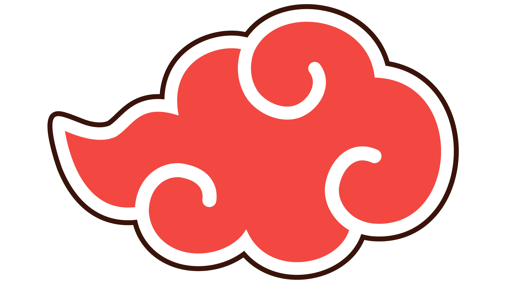

# 🌩️ Intranet Akakatsuki

<div align="center">
  
  
  ### *"Le monde connaîtra la douleur"*
  
  []()
  []()
  []()
</div>

---

## 📖 À propos

**Intranet Akakatsuki** est un projet collaboratif développé par un groupe d'étudiants en IUT qui ont décidé de transformer leur quotidien académique en une organisation ninja secrète inspirée de l'univers Naruto. 

Ce site web sert à la fois de :
- 🎭 **Plateforme de roleplay** avec des personnages, compétences et histoires personnalisées
- 📅 **Gestionnaire d'emploi du temps** automatisé via GitHub Actions
- 👥 **Annuaire des membres** avec leurs "primes" et techniques spéciales
- 📚 **Hub de liens** vers les ressources universitaires

## ✨ Fonctionnalités principales

### 🔐 Système d'authentification Firebase
- Connexion sécurisée pour accéder aux archives internes
- Gestion des sessions utilisateur
- Protection des pages sensibles

### 📅 Calendrier intelligent
- **Mise à jour automatique** de l'emploi du temps via GitHub Actions (toutes les heures)
- Support de 2 groupes (G1 et G2)
- Import depuis les fichiers ICS de l'université
- Navigation par semaine
- Affichage optimisé par jour

### 👤 Profils des membres
- Galerie interactive avec auto-play
- Fiches détaillées : pseudo, nom réel, techniques, palmarès
- Système de "primes" (comme les avis de recherche ninja)
- Histoires personnalisées (lore)

### 📜 Histoire de l'organisation
- Interface livre 3D interactif
- Navigation par chapitres
- Animation d'ouverture immersive

### 📱 Progressive Web App (PWA)
- Installation possible sur mobile
- Expérience native

## 🛠️ Technologies utilisées

### Frontend
- **HTML5 / CSS3** - Structure et design
- **Vanilla JavaScript** - Logique applicative
- **Firebase Authentication** - Gestion des utilisateurs

### Backend / Automation
- **GitHub Actions** - Automatisation du téléchargement des emplois du temps
- **Fichiers ICS** - Format d'import calendrier

### Hébergement
- GitHub Pages


## 📂 Structure du projet

```
intranet-akakatsuki/
├── index.html                   # Page d'accueil
├── manifest.json                # Configuration PWA
├── README.md
├── src/
│   ├── css/
│   │   ├── style-calendrier.css # Styles page du calendrier
│   │   ├── style.css            # Styles globaux
│   │   ├── style-histoire.css   # Styles page d'histoire
│   │   ├── style-index.css      # Styles page d'acceuil
│   │   ├── style-membres.css    # Styles page de membres
│   │   └── style-secret.css     # Styles page secrète
│   ├── emploi-du-temps/
│       ├── emploi-du-temps-G1.ics
│       └── emploi-du-temps-G2.ics
│   ├── html/
│   │   ├── calendrier.html      # Emploi du temps
│   │   ├── histoire.html        # Histoire de l'Akatsuki
│   │   ├── membres.html         # Profils des membres
│   │   └── secret.html          # Événements majeurs
│   ├── js/
│   │   ├── auth.js              # Vérification auth (pages protégées)
│   │   ├── calendrier.js        # Gestion emploi du temps
│   │   ├── histoire.js          # Animation livre 3D
│   │   ├── login.js             # Authentification Firebase
│   │   ├── membres.js           # Carrousel de membres
│   │   └── style.js             # Animations générales
│   └── img/
│       └── ...                  # images
└── .github/
    └── workflows/
        └── update-emploi.yml  # Automation emploi du temps
```

## 🎭 L'équipe Akakatsuki

- **Pain Perdu** - Leader & Développeur principal
- **Konass** - Unique femme de l'organisation
- **Itachibre** - Maître du Sharingan
- **Kisamerde** - Expert Suiton
- **Deidarabe** - Spécialiste explosifs (et beatbox)
- **Sassoumi** - Marionnettiste & Expert Linux
- **Orochipartout** - Immortel & Joueur de foot
- **Grobito** - Maître du Kamui
- **Kakakuzu** - Gestionnaire financier (et hépatique)
- **Hidanus** - Fidèle de Jashin
- **Zezettesou** - Créateur de réalités alternatives

## 📜 License

Ce projet est sous licence MIT. Voir le fichier `LICENSE` pour plus de détails.

## 🙏 Remerciements

- L'univers Naruto pour l'inspiration
- L'IUT du Havre pour... les cours (parfois)
- Firebase pour l'hébergement gratuit de l'authentification
- GitHub Actions pour l'automatisation
- Tous les membres de l'Akakatsuki pour leur dévouement

---

<div align="center">
  <p><i>"La douleur est le chemin vers la compréhension mutuelle."</i></p>
  <p><b>- Pain</b></p>
  
  <br>
  
  **Fait avec ❤️ (et beaucoup de procrastination) par l'Organisation Secrète des Nuages Rouges**
  
  <br>
</div>
